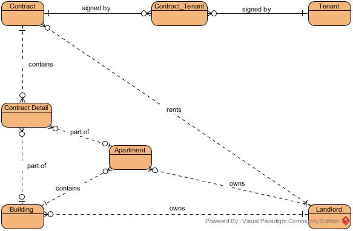

# Apartments rental modelling

* A contract can consist of one item (such as a whole building or one apartment) or multiple items (for example multiple apartments of the same or different building), I created `contract_detail` table to cope with this situation. It is also a good idea to expand later into facility like yarn or root top if they can be taken into account the items of rental contract
* Since we also need to link back to the object (building or apartment), I generally call them property, and provide `propertyId` as a reference, but the name of the item (building name, apartment number/name) must be taken into contract details.
* Since one or multiple tenants can sign the same contract, and a tenant can sign multiple different contracts, I created `contract_tenant` table to adapt with this many-to-many relationship.

# Implementation 

The modeling is implemented by using JPA so it can later be used by Spring Data or Hibernate. I just prefer to use Annotations over XML configuration/mapping in this case.